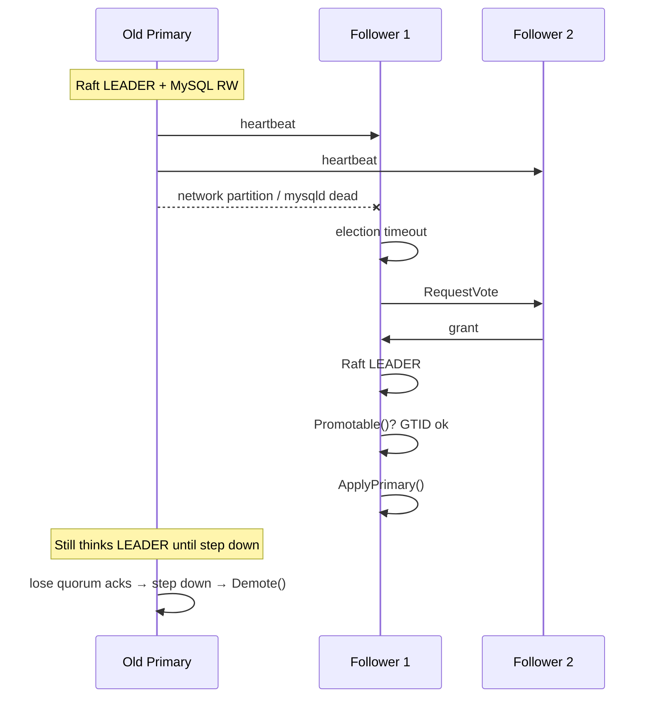
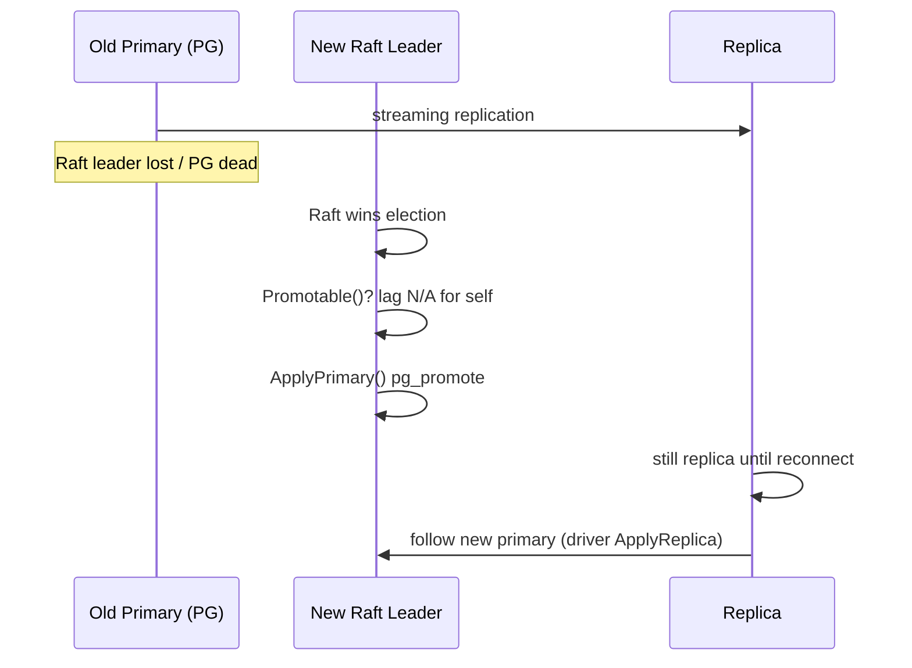

# NeoHA Architecture

> **Status:** Target architecture for the full product (Patroni-class shell + Xenon-class MySQL depth + native PostgreSQL + pluggable coordination). Sections marked **TBD** are intentional placeholders.
>
> **Related:** [config-design.md](./config-design.md) · [TODO.md](./TODO.md) · [ha-failover.md](./ha-failover.md) · `internal/database/driver.go`

---

## 1. Vision and positioning

NeoHA is a **single HA framework** for relational databases:

- **MySQL** — semi-sync replication and Group Replication (MGR), with Xenon/xenon-mgr-style semantics.
- **PostgreSQL** — streaming replication, sync standby, pg_rewind, slots — implemented **natively in NeoHA**, not by embedding or forking Patroni.
- **Coordination** — pluggable backends: embedded **Raft** (Xenon-style P2P), **etcd**, and eventually Consul, Kubernetes, ZooKeeper.

Design references:

| Project | What we borrow | What we do **not** do |
|---------|----------------|------------------------|
| **Patroni** | Cluster identity (`scope`/`name`), tags, REST shell, bootstrap vs runtime, DCS abstraction, reconcile loop shape | Import Patroni; copy its API; PG-only etcd assumption |
| **Xenon** | Embedded Raft, GTID/semi-sync/MGR election rules, peer RPC, role states (Idle/Learner/Invalid) | Stay MySQL-only; stay Raft-only |

**Goal:** Patroni + Xenon **as one product**, with **both engines** and **multiple coordination providers**, and a **richer role/eligibility model** where it adds value.

---

## 2. Non-goals (explicit)

- Drop-in replacement for Patroni or Xenon configs/APIs.
- Running Patroni alongside NeoHA on the same PG instance.
- One YAML that silently configures both MySQL and PostgreSQL on the same node.
- Multi-primary MySQL in v1 (MGR single-primary only).
- Cross-region active-active (future research; not v1).

---

## 3. Layered architecture

```
┌──────────────────────────────────────────────────────────────────────────┐
│ L1  Shell                                                                 │
│     neoha process, restapi, neohactl, watchdog, logging, metrics         │
├──────────────────────────────────────────────────────────────────────────┤
│ L2  Coordination (Coordinator)                                            │
│     provider: raft | etcd | consul | kubernetes | zookeeper               │
│     cluster membership, leader record, epoch/view, dynamic cluster config │
├──────────────────────────────────────────────────────────────────────────┤
│ L3  HA Reconcile                                                          │
│     observe coordination → evaluate candidacy → desired DB role → apply   │
│     engine-specific Evaluator (MySQL / PostgreSQL)                        │
├──────────────────────────────────────────────────────────────────────────┤
│ L4  Database Driver                                                       │
│     mysql.Driver | postgresql.Driver — promote, replicate, health, hooks  │
├──────────────────────────────────────────────────────────────────────────┤
│ L5  Manager (optional)                                                    │
│     mysqld/postmaster lifecycle, backup/restore (Xtrabackup, pg_basebackup)│
└──────────────────────────────────────────────────────────────────────────┘
```

**Dependency rule:** upper layers depend on **interfaces** below; L2 must not import `mysql` or `postgresql` packages.

### 3.1 Current code map (as of v0.1.4)

> **Versioning:** `v0.1.1`–`v0.1.4` are incremental dev milestones on `dev`; **Git tag `v0.2.0`** is the release after PR merge (bundles v0.1.1–v0.1.4). See [§15](#15-implementation-roadmap).

| Layer | Target package | Today (2026-06) |
|-------|----------------|-----------------|
| L1 | `cmd/neoha`, `internal/server`, `api/v1`, `internal/neohactl` | ✅ MySQL + PG agent path; REST partial |
| L2 | `internal/coordination/*`, `internal/coordination/wire` | ✅ Raft via `raftadapter`; **etcd MVP** in `coordination/etcd/`; legacy `internal/election/raft` still hosts consensus SM |
| L3 | `internal/ha` | ✅ `Reconciler` + `delegate_db_apply` + `primary_hooks`; Raft still contains MySQL-coupled handlers when delegate off |
| L4 | `internal/database` + drivers | ✅ `driver` interface; MySQL + **PostgreSQL** drivers; legacy `GetMysql()` still used in some raft paths |
| L5 | `internal/manager` | ✅ `mysqld`, backup; **no postmaster** yet |

Granular v0.1.1–v0.1.4 delivery log: [§15.2](#152-delivered-items-v011v014). Ongoing work: [TODO.md](./TODO.md).

---

## 4. Core interfaces

### 4.1 Coordinator (L2)

Abstracts **cluster coordination** regardless of backend.

```go
// internal/coordination/coordinator.go

type Member struct {
    ID       string            // endpoint
    Name     string            // config name
    Database string            // mysql | postgresql
    Tags     map[string]bool
    Meta     map[string]string // TBD
}

type ClusterView struct {
    LeaderID string
    Members  []Member
    Epoch    uint64            // raft epoch / DCS generation
    ViewID   uint64            // raft view; 0 for pure DCS
}

type Coordinator interface {
    Start(ctx context.Context) error
    Stop() error

    LocalID() string
    IsLeader() bool
    ClusterView(ctx context.Context) (ClusterView, error)
    Watch(ctx context.Context) (<-chan ClusterView, error)

    // Membership mutations (may be no-op or delegated for external DCS)
    AddMember(ctx context.Context, id string) error
    RemoveMember(ctx context.Context, id string) error

    // Dynamic cluster config blob (failover policy, sync mode, …) — TBD schema
    GetClusterConfig(ctx context.Context) ([]byte, error)
    SetClusterConfig(ctx context.Context, cfg []byte) error
}
```

Construct implementations with `coordination/wire.NewCoordinator(conf, raft)` (avoids import cycles between `coordination` and `raftadapter`).

**Implementations:**

| Provider | Package | Leader mechanism | Member list |
|----------|---------|------------------|-------------|
| `raft` | `coordination/raftadapter` | Raft state machine (today: `internal/election/raft`) | `peers.json` + RPC |
| `etcd` | `coordination/etcd` | Key lease / lock | Keys under `{namespace}{scope}/members/` **TBD** |
| others | TBD | TBD | TBD |

**Important:** For `provider=raft`, the Raft **consensus leader** is the cluster leader **for HA purposes** in v1. For `provider=etcd`, the DCS lock holder is leader; Raft is not running. **TBD:** whether to support “Raft for membership + DCS for lock” hybrid — likely **no** in v1.

### 4.2 Database Driver (L4)

See `internal/database/driver/`:

- `CandidacyEvaluator` — may this node become primary?
- `RoleApplier` — make it primary/replica/demoted
- `Lifecycle` — ping, bootstrap setup
- `StatusReporter` — CLI/API status

Callers use `database.Driver`, not `*mysql.Mysql`.

### 4.3 Reconciler (L3)

Patroni `Ha.run_cycle` equivalent; **NeoHA-native**.

```go
// internal/ha/reconcile.go (target)

type DesiredState struct {
    CoordRole   CoordRole   // Leader, Follower, Candidate, … — from L2
    DBRole      database.DBRole
    Primary     database.PrimaryRef
    Reason      string
}

type Reconciler struct {
    coord     coordination.Coordinator
    driver    database.Driver
    eval      database.CandidacyEvaluator // usually same as driver
    tags      config.TagsConfig
    // ...
}

func (r *Reconciler) RunOnce(ctx context.Context) error
func (r *Reconciler) Loop(ctx context.Context) // tick + event driven
```

**Reconcile steps (every cycle):**

1. Read `ClusterView` from Coordinator.
2. Read local `Health` from Driver.
3. If `tags.nofailover` and would promote → stay replica.
4. Compute `DesiredState`:
   - Am I coordination leader? → candidate for primary.
   - If not leader → replica (or idle/learner if coordination says so).
5. Run `CandidacyEvaluator.Promotable()` before primary.
6. Invoke `RoleApplier` idempotently (already primary → noop).
7. Emit metrics / update Server state for RPC.

**TBD:** event-driven vs fixed `loop_wait` interval; likely both (watch from Coordinator + max interval).

### 4.4 Server composition (L1)

Target `server.Server` wiring:

```
Config → Coordinator(provider) + Driver(type) + Reconciler + Manager(optional)
       → nrpc services (Node, Raft/Coord, Database RPC, Manager RPC)
       → restapi (optional)
```

Today `server.NewServer` hard-wires `election.Election` → `raft.Raft` → `mysql`.

---

## 5. Role models

### 5.1 Coordination roles (L2)

**Raft provider** (today `internal/election/raft/attr.go`):

| State | Meaning |
|-------|---------|
| FOLLOWER | Accept heartbeats/votes |
| CANDIDATE | Seeking election |
| LEADER | Sends heartbeats, admits acks |
| IDLE | HA disabled; rejects votes/heartbeats |
| LEARNER | Vote-only / no replication (Xenon sentinel) |
| INVALID | GTID/local-trx violation; no promotion |
| STOPPED | Process stopping |

**External DCS provider:** map to logical `{Leader, Replica, Unknown}` for reconcile; **TBD** whether to expose Idle/Learner via tags only.

### 5.2 Database roles (L4)

Engine-agnostic (`database.DBRole`):

| Role | MySQL realisation | PostgreSQL realisation |
|------|-------------------|------------------------|
| Primary | read_write, semi-sync master / MGR primary | promote, primary conn |
| Replica | read_only, change master / MGR secondary | recovery.conf, follow primary |
| ReadOnly | demoted old primary | demoted primary |
| Invalid | unpromotable GTID / local trx | lag too high / rewind failed |

### 5.3 Mapping coordination leader → DB primary

**Default rule (both engines):**

> If this node is **coordination leader** and **promotable** and **not tagged nofailover**, desired DB role = **Primary**. Otherwise **Replica** (or **Invalid** if driver says so).

**Exceptions (TBD catalog):**

- Manual `trytoleader` / maintenance mode
- Learner: coordination member but never primary
- Split-brain prevention: old primary loses coordination leadership → **must demote** even if MySQL still writable
- MGR: extra gate on `GROUP_REPLICATION` member state (ONLINE, PRIMARY)

---

## 6. MySQL path (deep dive)

### 6.1 Replication modes

| Mode | Config | Election/eligibility inputs |
|------|--------|----------------------------|
| **Semi-sync** | `replication-mode: semi-sync` | GTID compare, `Promotable()`, semi-sync ack quorum, heartbeat ack count |
| **MGR** | `replication-mode: mgr` | MGR member state, `mgrPrimaryPromotable`, GTID, group quorum **TBD** vs NeoHA raft quorum relationship |

NeoHA Raft and MySQL MGR are **two layers**: Raft picks the **NeoHA leader** who orchestrates MySQL; MGR is the **MySQL replication substrate**. Failover flow: Raft elects new NeoHA leader → driver executes MGR primary switch / read_only / group ops.

### 6.2 MySQL driver responsibilities

| Operation | Semi-sync | MGR |
|-----------|-----------|-----|
| Bootstrap | repl user, read_only, start slave | repl user, read_only, GR bootstrap/join **TBD** split with raft |
| Become primary | stop slave, read_write, semi-sync on, purge binlog | GR promote primary, sysvars |
| Become replica | change master to, read_only, start slave | GR secondary, read_only |
| Demote | read_only, stop/write guard | MGR demote / read_only |
| Health | admin ping, `SHOW SLAVE STATUS` | + `performance_schema.replication_group_members` |
| Candidacy | GTID subtract, local trx count, semi-sync | MGR stats, GTID, local trx |

Version handlers: `mysql56`, `mysql57`, `mysql80` — SQL dialect and sysvars (`internal/database/mysql/*`).

### 6.3 Xenon parity checklist (MySQL)

- [x] Embedded Raft (v0.1)
- [x] Semi-sync GTID election (v0.1)
- [x] MGR path (v0.1, gaps in tests)
- [x] Idle / Learner / Invalid roles
- [x] Learner sentinel (minority)
- [ ] Binlog purge policy edge cases
- [ ] Local commit / split-brain hardening (README open items)
- [ ] IO/SQL thread hang detection
- [ ] `failover-on-too-many-connections`

### 6.4 MySQL failover sequence (semi-sync, raft provider)



---

## 7. PostgreSQL path (deep dive)

PostgreSQL uses the **same L2/L3 framework**; **L4 is entirely separate** from MySQL.

### 7.1 Design stance

- **Not** “call Patroni” or “reuse Patroni's Python DCS”.
- **Yes** to similar **behaviour**: DCS or Raft decides leader → node runs promote/follow → rewind/slots/lag checks.
- `provider=raft` **is supported** for PG: Raft leader runs `pg_promote()` (or equivalent) via PG driver.

### 7.2 PostgreSQL driver responsibilities

| Operation | Description |
|-----------|-------------|
| `SetupBootstrap` | initdb path or join existing; `pg_hba`; replication user |
| `ApplyPrimary` | `pg_ctl promote`, adjust GUC, open connections, create slots **TBD** |
| `ApplyReplica` | `primary_conninfo`, recovery config, restart if needed, pg_rewind |
| `Demote` | Promote competitor exists → stop writes, follow new primary |
| `Promotable` | `pg_wal_lsn_diff`, lag vs `maximum_lag_on_failover`, timeline check |
| `Status` | `pg_is_in_recovery()`, replay lag, slot status |
| Health probe | TCP/SQL ping loop (mirror MySQL `PingStart`) |

Version handlers: `postgresql14`, `postgresql15`, `postgresql16` — minor GUC/recovery differences.

### 7.3 PostgreSQL failover sequence (raft provider)



### 7.4 PostgreSQL with etcd provider

Same driver; Coordinator implementation changes:

- Leader = etcd lock holder under `{namespace}{scope}/leader`.
- Members registered under `{namespace}{scope}/members/{name}`.
- Reconcile loop identical; **TBD** NeoHA key schema vs optional Patroni-compatible layout.

### 7.5 PG open items (TBD)

- [ ] Timeline comparison rules after promote
- [x] `pg_rewind` automatic vs manual
- [ ] Synchronous commit / `synchronous_standby_names` management
- [ ] Cascade replica support
- [ ] PgBouncer integration / `noloadbalance` tag semantics
- [ ] Standby cluster / remote primary (Patroni has `standby_cluster`) — config placeholder exists in bootstrap today

---

## 8. Coordination provider comparison

| Aspect | Raft (embedded) | etcd / Consul / K8s |
|--------|-----------------|---------------------|
| **Deps** | None (P2P) | External cluster |
| **Split brain** | Quorum + epoch | Lease TTL + fencing **TBD** |
| **Ops familiarity** | Xenon users | Patroni/K8s users |
| **Multi-AZ** | Need odd quorum across sites | DCS ops model |
| **MySQL** | ✅ semi-sync / MGR + Raft | etcd MVP (PG IT); Consul/K8s **TBD** |
| **PostgreSQL** | ✅ Driver + Raft IT | ✅ etcd DCS MVP + IT |

**NeoHA “more powerful” angle:** same reconcile code, **swap provider per environment** without swapping DB engine or product.

---

## 9. RPC, CLI, and API

### 9.1 NeoHA RPC (nrpc)

Today: per-node RPC on `endpoint`.

| Service | Purpose |
|---------|---------|
| `RaftRPC` | Peers, epoch, purge, semi-sync check |
| `HARPC` | enable/disable HA, trytoleader, learner |
| `MysqlRPC` | SQL-side status, users, sysvars |
| `NodeRPC` / `ServerRPC` / `UserRPC` | Cluster membership, users |
| `MysqldRPC` / `BackupRPC` | Process + backup |

**Target:** rename/generalise to `CoordRPC` + `DatabaseRPC` (mysql/pg backend). PG gains `PostgresqlRPC` mirroring mysql.

### 9.2 neohactl

Cluster-oriented commands (`cluster`, `raft`, `mysql`, …). **Target:** `neohactl mysql` vs `neohactl postgresql` subcommands; shared `cluster status` renders via `Driver.Status()`.

### 9.3 REST API (`restapi`, `api/v1`)

Partial (`api/v1` tests exist). **TBD:** OpenAPI spec, Patroni-like endpoints vs NeoHA-native `/v1/cluster`, auth model.

---

## 10. Bootstrap and lifecycle

### 10.1 Process startup

```
main → load config → validate
     → NewServer → Driver.SetupBootstrap (if first run flag TBD)
     → Coordinator.Start → Driver.Start (ping)
     → Reconciler.Loop (async)
     → nrpc.Listen
     → optional REST
     → signal handler → graceful Stop
```

### 10.2 Bootstrap vs steady state

| Phase | Config section | Runs when |
|-------|----------------|-----------|
| First init | `bootstrap.*` | Empty datadir / init flag |
| Daily ops | `database.*`, `coordination.*` | Every start |
| Failover | reconcile only | Runtime |

---

## 11. Manager layer (L5)

Optional **database process** control (not the HA agent itself):

| Component | MySQL | PostgreSQL |
|-----------|-------|------------|
| Start/stop/kill | `manager/mysqld` | `manager/postmaster` **TBD** |
| Backup | Xtrabackup + SSH | pg_basebackup **TBD** |
| Monitor | mysqld process check | postmaster check **TBD** |

**Boundary:** Manager manipulates OS processes; Driver manipulates SQL role/recovery. Manager may be invoked from backup RPC without going through reconcile.

---

## 12. Testing strategy (architecture-level)

| Layer | Unit | Integration |
|-------|------|-------------|
| Coordinator | mock clock, simulated peers | multi-process raft tests (today) |
| Driver | sqlmock / pg mock | real MySQL 8.0 IT harness |
| Reconcile | inject coord + driver fakes | failover IT scenarios |
| End-to-end | — | `test/integration/*` |

**TBD:** PG integration harness mirroring `harness/mysql80.go`.

---

## 13. Security

**TBD detailed threat model.** Initial points:

- NeoHA RPC has no auth in v0.1 — **must** add TLS + token for production.
- REST authentication config exists but underused.
- Replication credentials in config files — support env/vault overlay.
- `leader-start-command` / hooks — shell injection risk; validate or restrict.

---

## 14. Observability

| Signal | Source |
|--------|--------|
| Raft stats | `internal/election/raft/stats.go` |
| MySQL stats | `internal/database/mysql/stats.go` |
| Server uptime | `internal/server` |
| **TBD** | Prometheus metrics, structured audit log for failover |

---

## 15. Implementation roadmap

Phases align with [TODO.md](./TODO.md) (open items only).

### Versioning convention

| Label | Meaning |
|-------|---------|
| **v0.1.0** | Tagged baseline (MySQL HA + Raft); on `main` / historical tag |
| **v0.1.1 – v0.1.4** | Incremental **dev milestones** on `dev` (one row per architecture deliverable in §15.2) |
| **v0.2.0** | **Release tag** after PR merge — packages all delivered v0.1.1–v0.1.4 work; not tagged until merge |
| **v0.3.0+** | Next roadmap phases (formerly sketched as “v0.6”) |

**Delivered** dev milestones (ship in **v0.2.0** release):

| Phase | Status | Deliverable |
|-------|--------|-------------|
| **v0.1.0** | ✅ tagged | MySQL semi-sync/MGR + embedded Raft; CI; IT harness |
| **v0.1.1** | ✅ | `driver.go` + mysql/pg driver stubs; `coordination` + `ha/reconcile` scaffold; config `coordination.*` + `Validate()` |
| **v0.1.2** | ✅ | Reconciler apply + `delegate_db_apply`; mysql `Driver`; raft DB ops via dbDriver; MGR two-phase promote path |
| **v0.1.3** | ✅ | PG `Driver` (bootstrap/promote/demote); `primary_hooks`; PG + Raft IT |
| **v0.1.4** | ✅ | etcd Coordinator MVP; PG ApplyReplica / pg_rewind / lag; MGR majority-loss; IT warm fixtures; HA docs |
| **v0.2.0** | ⏳ merge → tag | GitHub **Release** bundling v0.1.1–v0.1.4 (this PR) |
| **v0.3.0** | — | REST cluster API; dynamic config in DCS |
| **v1.0.0** | — | Production readiness criteria **TBD** (docs, auth, matrix green, schema stable) |

### 15.2 Delivered items (v0.1.1–v0.1.4)

Archive of the former [TODO.md](./TODO.md) scaffold checklist — **one row per PR-sized deliverable**, with code locations. All rows below are included in the planned **v0.2.0** release.

#### L2 — Coordination

| Ver | Item | Location |
|-----|------|----------|
| v0.1.1 | `coordination.Coordinator` interface | `internal/coordination/coordinator.go` |
| v0.1.1 | Raft adapter | `internal/coordination/raftadapter/` |
| v0.1.1 | Provider factory / wire | `internal/coordination/wire/factory.go` |
| v0.1.1 | `coordination.*` config + `Validate()` (accepts legacy `election.*`) | `internal/config/config_validate.go` |
| v0.1.4 | etcd DCS + election lifecycle | `internal/coordination/etcd/`, `internal/election/` |
| v0.1.4 | PG + etcd example config | `configs/examples/postgresql/etcd-node1.yaml` |

#### L3 — HA Reconcile

| Ver | Item | Location |
|-----|------|----------|
| v0.1.1 | `ha.Reconciler` skeleton | `internal/ha/reconcile.go` |
| v0.1.2 | Reconciler apply (demote safety net; promote gated) | `internal/ha/reconcile.go` |
| v0.1.2 | Server reconcile loop | `internal/server/server.go` |
| v0.1.2 | `ha.delegate_db_apply` — MGR two-phase promote delegated to Driver | `internal/database/mysql/driver.go`, `internal/ha/reconcile.go`, `internal/election/raft/leader.go` |
| v0.1.2 | `ApplyReplica` + integration delegate path | `internal/ha/reconcile.go`, `test/integration/harness/` |
| v0.1.2 | Raft: remove remaining direct MySQL promote when delegate on | `internal/election/raft/leader.go`, `follower.go` |
| v0.1.3 | `ha.primary_hooks` (VIP etc.) | `internal/ha/primary_hook.go` |
| v0.1.4 | MGR majority-loss: sole survivor force-bootstrap + read-only PRIMARY | `internal/election/raft/candidate.go`, `internal/database/mysql/mysqlbase.go`, `internal/ha/reconcile.go` |
| v0.1.4 | MGR rejoin → writable when quorum ≥ 2 (`mgrQuorum=2`) | `internal/ha/reconcile.go`, `internal/database/mysql/driver.go` |

#### L4 — Database Driver

| Ver | Item | Location |
|-----|------|----------|
| v0.1.1 | `database/driver` interface | `internal/database/driver/driver.go` |
| v0.1.1–v0.1.2 | MySQL `Driver` implementation | `internal/database/mysql/driver.go` |
| v0.1.2 | Raft calls dbDriver: Promotable / Demote / ChangeToMaster | `internal/election/raft/dbops.go` |
| v0.1.4 | PG bootstrap / promote / demote / status | `internal/database/postgresql/driver.go` |
| v0.1.4 | PG `ApplyReplica` (primary_conninfo + slot) | `internal/database/postgresql/replica.go` |
| v0.1.4 | PG `pg_rewind` automation | `internal/database/postgresql/rewind.go` |
| v0.1.4 | PG `ReplicationLagBytes` / Promotable lag check | `internal/database/postgresql/lag.go` |

#### Config, tests, documentation

| Ver | Item | Location |
|-----|------|----------|
| v0.1.1+ | Example YAML with inline comments | `configs/examples/*.yaml`, `configs/README.md` |
| v0.1.4 | IT: warm fixture, parallel `StartAll`, 150 ms poll, segment timing | `test/integration/harness/backend.go`, `*_warm_test.go` |
| v0.1.4 | PG IT: ApplyReplica, pg_rewind, etcd failover | `test/integration/harness/postgresql.go`, `pg_*_test.go` |
| v0.1.4 | MGR IT: delegate path, majority-loss, dedicated ports | `test/integration/mgr_neoha_test.go` |
| v0.1.4 | Semi-sync IT: failover fix + Xenon-style 2s×5 heartbeat | `test/integration/semisync_neoha_test.go`, `harness/neoha.go` |
| v0.1.4 | MySQL HA failover guide | [ha-failover.md](./ha-failover.md) |
| v0.1.4 | Architecture + config design | this doc, [config-design.md](./config-design.md) |
| v0.1.4 | Deployment guide | [deployment.md](./deployment.md) |

**Not yet done (see TODO P0 / backlog):** Raft package internal refactor (§15.1), Consul/K8s providers, REST **v0.3.0**, postmaster (L5), full removal of `GetMysql()` from raft.

### 15.1 Refactor guardrails (from prior discussion)

- Do **not** merge Idle/Learner/Invalid into one passive role.
- Prefer minimal diffs; keep mock injection for raft tests.
- Raft internal refactor (etcd-style step loop) is **deferred** until Driver/Coordinator boundaries exist.

---

## 16. Open questions (architecture)

### Coordination

- [ ] Single leader definition when `provider=raft` and MySQL MGR both have “primary” concepts — document invariants.
- [ ] Cross-provider migration (raft cluster → etcd) — likely unsupported v1.
- [ ] Dynamic reconfiguration without full restart.

### MySQL

- [ ] Local transaction detection → INVALID completeness.
- [ ] Semi-sync + 2-node vs 3-node timer differences (already partially config).
- [ ] MGR + Learner interaction with group quorum.

### PostgreSQL

- [ ] Exact promote API per version (SQL vs pg_ctl).
- [ ] Slot management: create on primary, drop on failover.
- [ ] Global cluster config: sync_standby list storage in DCS.

### Product

- [ ] Heterogeneous cluster (MySQL + PG same scope) — **likely no**.
- [ ] Read replicas outside coordination quorum (async only).
- [ ] Geo-distributed quorum guidance.

---

## 17. Glossary

| Term | Meaning |
|------|---------|
| **Coordinator** | L2 pluggable backend (Raft, etcd, …) |
| **Driver** | L4 engine-specific HA executor |
| **Reconcile** | L3 loop aligning coordination leader with DB role |
| **Provider** | Same as coordination backend (`coordination.provider`) |
| **Promotable** | Driver/evaluator says node may become primary |
| **Scope** | Cluster name (all members share scope) |
| **Endpoint** | NeoHA RPC address (`ip:port`) |

---

## 18. Document history

| Date | Change |
|------|--------|
| 2026-06-28 | Initial architecture doc (full-vision baseline) |
| 2026-06-29 | §3.1 / §8 / §15 updated; §15.2 delivery log; versioning v0.1.1–v0.1.4 → release **v0.2.0** |
