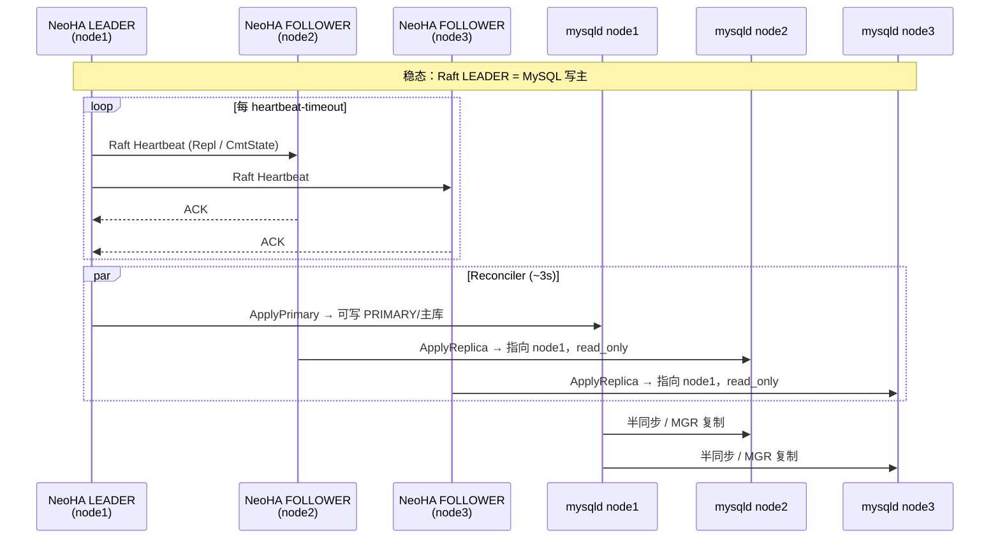
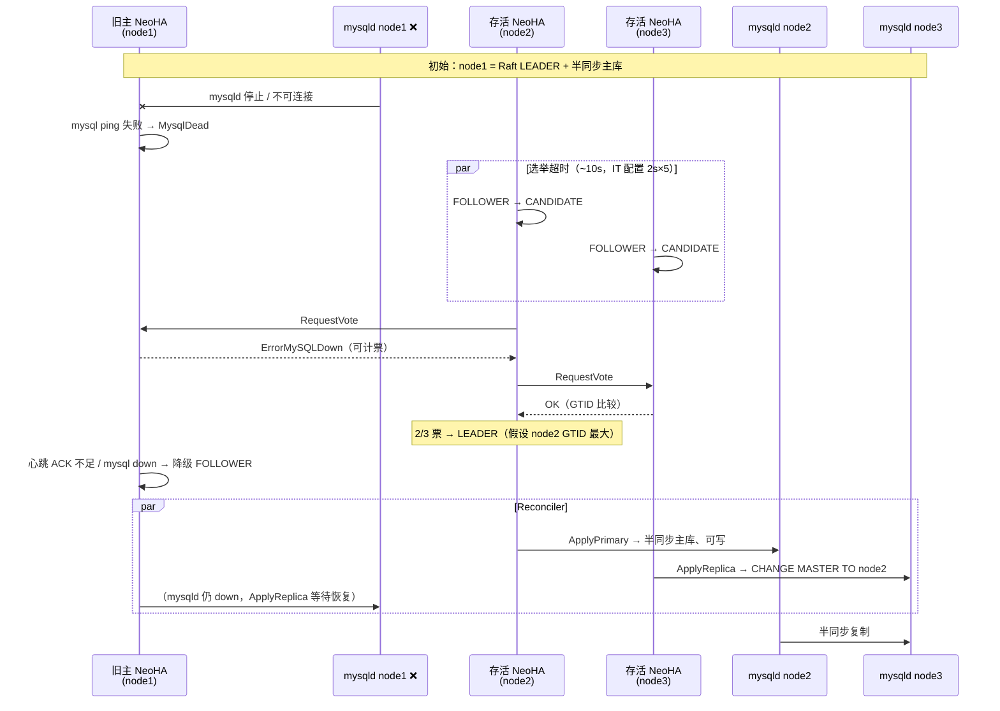
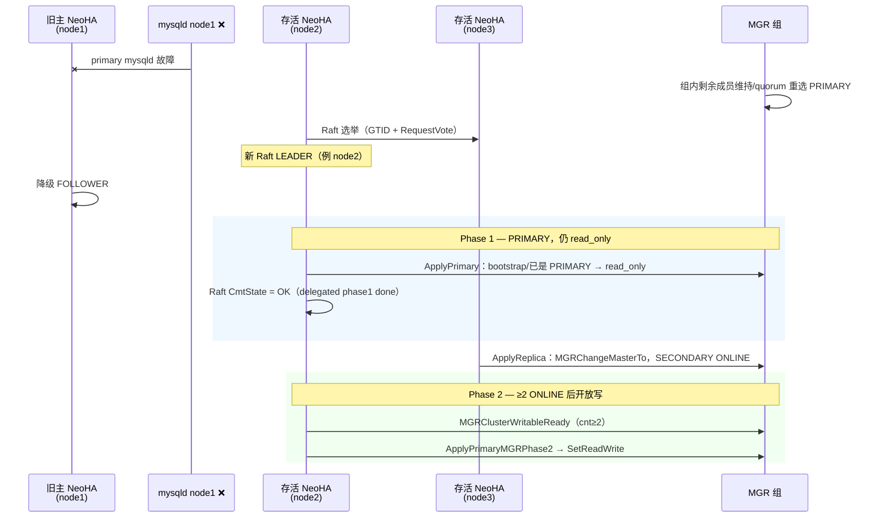
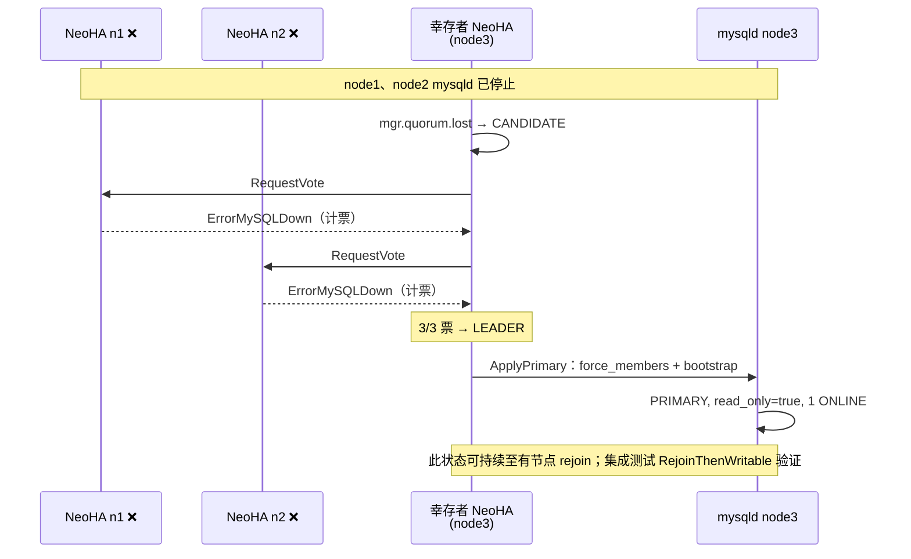
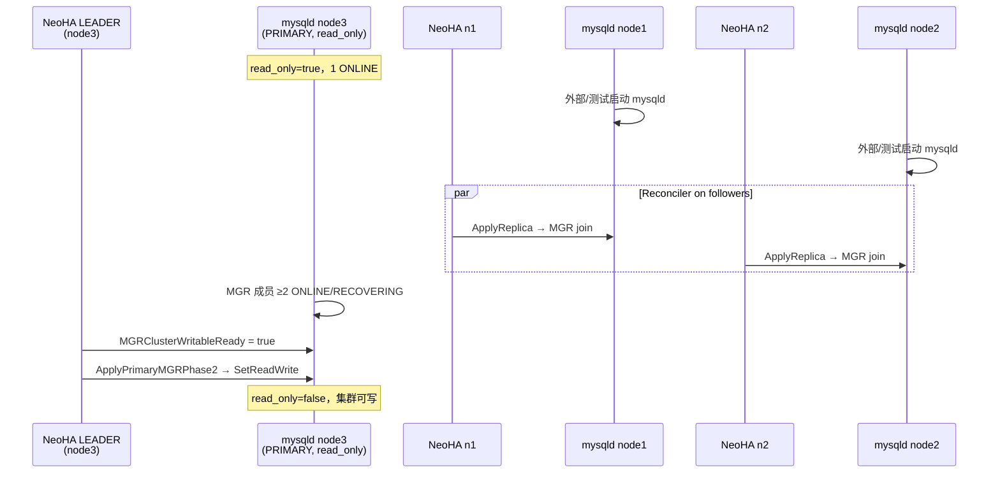

# NeoHA MySQL 高可用切换逻辑

> **适用范围：** 3 节点 MySQL 集群，协调层为内嵌 **Raft**（`coordination.provider=raft`），且开启 **`ha.delegate_db_apply=true`**（当前集成测试与推荐生产路径）。  
> **复制模式：** 半同步（semi-sync）或 Group Replication（MGR）。  
> **相关代码：** `internal/election/raft/` · `internal/ha/reconcile.go` · `internal/database/mysql/driver.go`  
> **架构背景：** [architecture.md](./architecture.md)

---

## 1. 两套「主」与分工

| 层面 | 含义 | 谁决定 |
|------|------|--------|
| **NeoHA Raft LEADER** | 集群协调主，负责心跳、选主、对外暴露 `LeaderDatabase` | Raft 状态机 |
| **MySQL 写主** | 实际接受写入的 mysqld | Reconciler + Driver（L3/L4） |

在 `delegate_db_apply=true` 时，Raft **不再直接**执行 `ChangeToMaster` / `SetReadWrite` / `ChangeMasterTo`，而是由 **Reconciler 周期循环**（默认约 3s）根据「我是否为 Raft LEADER」对齐本地 MySQL 角色。

```
┌─────────────┐     心跳 / 选主      ┌─────────────┐
│  Raft L2    │ ──────────────────► │  各节点 NeoHA │
│  (P2P RPC)  │                     │  LEADER/FOLLOWER│
└─────────────┘                     └───────┬───────┘
                                            │ Reconciler (L3)
                                            ▼
                                    ┌─────────────┐
                                    │ MySQL Driver│
                                    │ promote/    │
                                    │ replica     │
                                    └─────────────┘
```

**3 节点 quorum：** Raft 多数派为 **2/3**；MGR 写就绪同样要求 **≥2** 个成员 `ONLINE/RECOVERING`（`mgrQuorum=2`）。

---

## 2. 稳态（formation 完成后）

- **Raft LEADER 节点：** Reconciler 判定 `coord.leader.promotable` → `ApplyPrimary` → MySQL 可写（semi-sync 主库；MGR 为 PRIMARY 且满足 quorum 后可写）。
- **Raft FOLLOWER 节点：** Reconciler 判定 `not.coord.leader` → `ApplyReplica` → MySQL 只读从库（semi-sync replica 或 MGR SECONDARY）。
- **Raft：** LEADER 周期性向 FOLLOWER 发送 **Heartbeat**（携带复制位点 / MGR 提交状态 `CmtState`）。



---

## 3. 故障模型说明

下文「**主故障**」指 **primary 所在节点的 mysqld 进程停止或不可连接**（集成测试即 `StopNode`）。  
**NeoHA 进程默认仍在运行**（与 IT 一致）；生产环境若整机宕机，则该节点 Raft 与 MySQL 均不可用。

| 角色 | mysqld 挂掉后 | NeoHA 仍运行时 |
|------|----------------|----------------|
| **旧主 NeoHA** | 本地 MySQL 标记 `MysqlDead`，RPC 返回 `ErrorMySQLDown` | 可能短暂仍为 Raft LEADER，随后因心跳 ACK 不足或本地 mysql down **降级为 FOLLOWER** |
| **旧主 mysqld** | 停止接受连接 | 恢复后由 Reconciler **ApplyReplica** 重新挂到新主（MGR 未 joined 时会清缓存重试） |
| **存活从 NeoHA** | 本地 mysqld 正常 | 选举超时 → **CANDIDATE** → 请求投票 → 成为新 LEADER |
| **存活从 mysqld** | 仍为 replica/SECONDARY | 新 LEADER 上 Reconciler **ApplyPrimary**；本节点 **ApplyReplica** 指向新主 |

---

## 4. 半同步（Semi-Sync）— 单节点故障（minority loss）

**场景：** 3 节点中 **原主 mysqld 故障**，另 2 节点 NeoHA + mysqld 正常。  
**目标：** GTID 最新的存活节点成为 Raft LEADER，并提升为半同步主库；另一存活节点改为从其复制。

### 4.1 选主（Raft）

1. FOLLOWER 在 **election-timeout** 内未收到有效 LEADER 心跳 → 升为 **CANDIDATE**。
2. 向各 peer **RequestVote**，携带本地 GTID；仅 **GTID 不低于** 候选者的节点投赞成票。
3. 旧主 NeoHA 若仍存活但 mysqld  down：返回 **`ErrorMySQLDown`**。在 3 节点集群中，满足条件时可计为赞成票（`peers < 3` 分支，带短暂 `CandidateWaitFor2Nodes` 延迟）。
4. 获 **2/3** 赞成票 → **LEADER**。

### 4.2 数据库切换（Reconciler）

| 节点 | 行为 |
|------|------|
| **新 LEADER** | `ApplyPrimary`：`WAIT_UNTIL_SQL_THREAD_AFTER_GTIDS` → `ChangeToMaster` → `EnableSemiSyncMaster` → `SetReadWrite` |
| **另一 FOLLOWER** | `ApplyReplica`：`ChangeMasterTo(新主)` → `StartSlave`，保持 `read_only` |
| **旧主** | 降为 FOLLOWER 后：`Demote`（`read_only`）；mysqld 恢复后 `ApplyReplica` 指向新主 |

### 4.3 时序图



**旧主恢复后：** mysqld 启动 → NeoHA 重连 → Reconciler `ApplyReplica` → `ChangeMasterTo` 新主 → 作为从库同步。

---

## 5. MGR — 单节点故障（minority loss）

**场景：** 原 MGR PRIMARY 所在 **mysqld 故障**，MGR 组内仍剩 **≥2** 个存活成员，组内可自动选 PRIMARY。  
**NeoHA：** 同样在存活节点间完成 Raft 选主，并由 Reconciler 驱动 MGR 角色与 **两阶段写** 对齐。

### 5.1 MGR 与 Raft 的协同（delegate 模式）

| 阶段 | Raft LEADER | MySQL / MGR |
|------|-------------|-------------|
| **Phase 1** | `prepareSettingsMGRDelegated` 等待 Reconciler | `ApplyPrimary`：relay 追平 →（如需）bootstrap → **PRIMARY + read_only** |
| **Phase 2** | 检测到 `MGRClusterWritableReady`（≥2 ONLINE） | `ApplyPrimaryMGRPhase2` → **`SetReadWrite`** |
| **FOLLOWER** | Heartbeat `CmtState=CmtOK` 后 | Reconciler `ApplyReplica` → `MGRChangeMasterTo` 加入组 |

Raft LEADER 在 MGR 模式下还监控：**MGR ONLINE 数 < 2** 时累计 `lessCmtHtAcks`，过多则 **主动降级**（防止脑裂写）。

### 5.2 时序图



---

## 6. MGR — 多数派丢失（2 节点 mysqld 故障，1 幸存者）

**场景：** 3 节点中 **仅 1 个 mysqld 存活**，MGR **无法维持 quorum**（仅 1 个 ONLINE）。  
**设计目标（v0.1.4）：**

1. **Phase 1：** GTID 最大的幸存者成为 Raft LEADER，**force_members** 单节点 bootstrap → **PRIMARY + read_only**（允许 1 ONLINE）。
2. **Phase 2：** 故障节点 **mysqld 重新加入** 且 MGR **≥2 ONLINE** 后，才 **开放写**（`SetReadWrite`）。

### 6.1 Raft 在多数派丢失时的特殊规则

- 存活 FOLLOWER 检测到 **`mgr.quorum.lost`** → 立即 **升为 CANDIDATE**（不等待常规定时选举）。
- 故障节点 NeoHA 对 **RequestVote** 返回 **`ErrorMySQLDown`**：在 `mgrClusterEverOK` 时 **计为赞成票**，使单幸存者能凑够 **2/3** 成为 LEADER（逻辑上代表「已知 down 的 peer 不会阻碍重建」）。

### 6.2 Force bootstrap（ApplyPrimary / ChangeToMaster）

仅当 `performance_schema.replication_group_members` 显示 **live==1**（ sole survivor）时：

1. `SET group_replication_force_members = '<本机 GR 地址>'`
2. `STOP GROUP_REPLICATION`
3. recovery channel + **`bootstrap_group=ON`** → `START GROUP_REPLICATION`
4. 清除 `force_members`

### 6.3 时序图 — Phase 1（ sole survivor）



### 6.4 时序图 — Phase 2（rejoin 后开放写）



**注意：** 集成测试中 **仅重启 mysqld**，NeoHA 进程未停；`ApplyReplica` 依赖 `MGRReplicaJoined` 检测，若 mysqld 曾 down 过会 **清除 `lastReplicaPrimary` 缓存** 强制重配。

---

## 7. 旧主节点行为汇总

| 状态 | Semi-Sync | MGR |
|------|-----------|-----|
| **mysqld 故障，NeoHA 仍运行** | 仍可能短暂为 LEADER；mysql down 后降级；无法执行 SQL | 同左；MGR 进程停止 |
| **已降级为 FOLLOWER** | Reconciler `Demote` → read_only | 若仍在组内则随组角色；否则 STOP GR，等待 ApplyReplica |
| **mysqld 恢复** | `ApplyReplica` → 指向新主 `ChangeMasterTo` | `ApplyReplica` → `MGRChangeMasterTo`，直至 SECONDARY ONLINE |
| **不应出现** | 旧主长期可写且非 LEADER | 旧主在 quorum 不足时长期可写（Phase 2 前应保持 read_only） |

---

## 8. 三种场景对比

| 项目 | Semi-Sync minority | MGR minority | MGR majority loss |
|------|-------------------|--------------|-------------------|
| **故障范围** | 1 mysqld | 1 mysqld | 2 mysqld |
| **MGR quorum** | N/A | 通常仍 ≥2 | 1 ONLINE |
| **Raft 触发** | 选举超时 | 选举超时 / MGR 不健康 | **mgr.quorum.lost** 立即选主 |
| **ErrorMySQLDown 计票** | 3 节点时条件计票 | MGR + everOK 时计票 | **始终计票**（everOK） |
| **新主 MySQL** | 半同步主 + 可写 | PRIMARY；≥2 ONLINE 后可写 | PRIMARY **read_only** → rejoin 后可写 |
| **从库** | CHANGE MASTER + IO/SQL | MGR join SECONDARY | rejoin 后 MGR join |
| **IT 用例** | `TestNeoHASemiSyncWarmSuite/FailoverMinority` | `TestNeoHAMGRWarmSuite/FailoverMinority` | `TestNeoHAMGRFailoverMajorityLoss` |

---

## 9. 集成测试中的计时参数（参考）

| 模式 | heartbeat-timeout | admit-defeat-heartbeat-count | 主故障感知量级 |
|------|-------------------|------------------------------|----------------|
| Semi-sync IT | 2000 ms | 5 | ~10 s |
| MGR IT | 500 ms | 5 | 更快 |

Failover **子测试** 仅统计「停主 → 新主可写/复制就绪」段；完整用例还包含 datadir 初始化与集群成形，见 [TODO.md](./TODO.md) 与 [test/integration/README.md](../test/integration/README.md)。

---

## 10. 文档与代码索引

| 主题 | 位置 |
|------|------|
| Reconciler 主从对齐 | `internal/ha/reconcile.go` |
| MGR Phase1/2 | `internal/database/mysql/driver.go` — `applyPrimaryMGR`, `MGRClusterWritableReady` |
| MGR force bootstrap | `internal/database/mysql/mysqlbase.go` — `ChangeToMaster` |
| Raft 选主 / ErrorMySQLDown | `internal/election/raft/candidate.go` |
| MGR quorum 丢失选主 | `internal/election/raft/follower.go` |
| LEADER 心跳与 MGR 监控 | `internal/election/raft/leader.go` |
| FOLLOWER 跟随 / delegated join | `internal/election/raft/follower.go` |
| delegate 开关 | `config` — `ha.delegate_db_apply` |

---

## 变更记录

| 日期 | 说明 |
|------|------|
| 2026-06-29 | 初版：3 节点 semi-sync / MGR minority & majority-loss 切换逻辑与时序图 |
